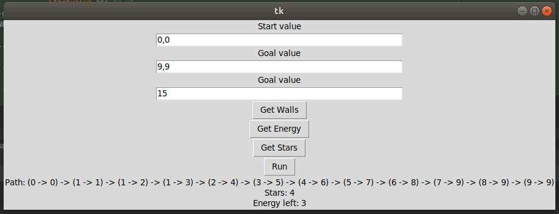

# Astart-DHBW-KI
A* implementation for a maze as a project for the module artificial intelligence at the DHBW

---
# Dokumentation
## Ziel
Es soll ein Programm erstellt werden, welches den besten Weg durch ein Labyrinth findet. Hierzu soll der A* Algorithmus verwendet werden.
## Parameter und Variablen
Labyrinth: 2 Dimensionalles Array Größe 10 mal 10. bei Initialisierung werden alle Felder als leer initialisiert (0)
Start und Ziel: Koordinaten im Labyrinth als "x, y" angegeben
Mauer
Sterne undEnergy: 
Das Labyrinth soll zudem verschidene Objekte beinhalten: Sterne, Mauern und Energie.
Die Position dieser Objekte werden aus 3 verschiedenen csv Dateien eingelesen.  
Energie und Sterne werden als Kordinaten in den csv Dateien gespeichert und dann ind dem Feld mit der angegebenen Position Platziert.  
Bei den Mauern wird in der csv 2 Koordinaten angegeben zwischen dem sich eine Mauer befinden soll. 
#### Feldererklärung
Die Felder des Labirinth werden mit Zahlen gekennzeichnet um seinen Inhalt darzustellen
+ 0 = Leeres Feld  
+ 1 = Feld mit angrenzender Mauer  
+ 2 = Feld mit Energy  
+ 3 = Feld mir Energy und angrenzender Mauer (Feld mit Mauer (1) plus (+) Feld mit Energy (2))
+ 4 = Feld mit Stern
+ 5 = Feld mit Stern und angrenzender Mauer  (Feld mit Mauer (1) plus (+) Feld mit Stern (3))   

Es ist nicht möglich von einem feld mit Mauer (1) auf ein anderes Feld mit Mauer zu gehen (1, 3, 5).  
Wenn man ein Feld mit Energy (2, 3) oder Stern (4, 5) betritt so wird dies um den Standardwert des Feldes reduziert (-2 oder -4)
dadurch wird diese Feld dann zu einem Leeren Felod oder einem mit Mauer (0, 1) und der Stern oder die Energie wird eingesammelt

# Umsetzung
Das Programm ist als Python Script umgesetzt welches in 2 verschidenen Modi verwendet werden.  
Einmal eine CLI Anwedung welces einmal durchläuft und das Ergebnis ausgibt.
Und ein Grafische Benutzeroberfläche wo die Eingabewerte mehrfach eingegeben werden können und das system mehrmals eingesetzt werden kann.

Ausgegeben wird in beiden Fällen der Pfad, die Anzahl gesammelter Sterne sowie die übrig gebliebene Energie.  

Verwendete Bibliotheken (müssen installiert sein):
+ pandas
+ numpy
+ tkinter
+ sys
+ argparse
+ filedialog 

#### CLI    
Alle Optionalen Parameter werden für den CLI Betrieb benötigt. Beispiel wie der aufruf des CLI befehls aussehen sollte
```shell script
foo@bar:~/Astart-DHBW-KI$ python3 A-Star-Version1.py -s "0,0" -g "9,9" -se 15 -w "CSV-Data/S_A01_Mauer.csv" -st "CSV-Data/S_A01_Stern.csv" -e "CSV-Data/S_A01_Energie.csv"
```
Ausgabe vom obigen Befehl

```shell script
Start CMD
### Enter start as: x,y | default 0, 0
### Enter goal as: x,y | default 9, 9
### Enter energy as number default 5
15
### 1) Generate Clean Maze ###
[[0. 0. 0. 0. 0. 0. 0. 0. 0. 0.]
 [0. 0. 0. 0. 0. 0. 0. 0. 0. 0.]
 [0. 0. 0. 0. 0. 0. 0. 0. 0. 0.]
 [0. 0. 0. 0. 0. 0. 0. 0. 0. 0.]
 [0. 0. 0. 0. 0. 0. 0. 0. 0. 0.]
 [0. 0. 0. 0. 0. 0. 0. 0. 0. 0.]
 [0. 0. 0. 0. 0. 0. 0. 0. 0. 0.]
 [0. 0. 0. 0. 0. 0. 0. 0. 0. 0.]
 [0. 0. 0. 0. 0. 0. 0. 0. 0. 0.]
 [0. 0. 0. 0. 0. 0. 0. 0. 0. 0.]]
### 2) Get Wall data from csv if empty uses example csv ###
### 3) Set Wall Data in maze ###
### 4) Get Energy data from csv if empty uses example csv###
### 5) Set Star Data in maze ###
### 6) Get Star data from csv if empty uses example csv###
### 7) Set Star Data in maze ###
[[0. 0. 0. 0. 0. 0. 0. 0. 0. 0.]
 [0. 0. 4. 0. 0. 0. 3. 1. 0. 0.]
 [0. 1. 1. 1. 0. 4. 1. 1. 0. 0.]
 [0. 1. 1. 1. 0. 0. 0. 0. 4. 0.]
 [0. 0. 4. 0. 0. 0. 0. 0. 0. 0.]
 [0. 0. 0. 0. 0. 0. 4. 0. 0. 0.]
 [0. 0. 0. 4. 0. 0. 1. 1. 0. 0.]
 [0. 0. 0. 0. 0. 0. 1. 1. 0. 4.]
 [0. 0. 2. 0. 0. 0. 0. 0. 0. 0.]
 [0. 0. 0. 0. 4. 0. 0. 0. 0. 0.]]
star
star
### 8) A* was successful ###
### 9) Print Path ###
[(0, 0), (1, 1), (1, 2), (1, 3), (2, 4), (3, 5), (4, 6), (5, 7), (6, 8), (7, 9), (8, 9), (9, 9)]
### 10) Print energy ###
3
### 11) print stars ###
4

Process finished with exit code 0

```
ClL help 
```shell script
foo@bar:~/Astart-DHBW-KI$ python3 A-Star-Version1.py -h
usage: A-Star-Version1.py [-h] [-s START] [-g GOAL] [-se STARTENERGY]
                          [-w WALLS] [-st STARS] [-e ENERGY]

optional arguments:
  -h, --help            show this help message and exit
  -s START, --start START
                        Startvalue as: "x,y"
  -g GOAL, --goal GOAL  Goalvalue as: "x,y"
  -se STARTENERGY, --startenergy STARTENERGY
                        Energy as number
  -w WALLS, --walls WALLS
                        Path to wall csv
  -st STARS, --stars STARS
                        Path to star csv
  -e ENERGY, --energy ENERGY
                        Path to energy csv

```
GUI
```shell script
foo@bar:~/Astart-DHBW-KI$ python3 A-Star-Version1.py 
```



```shell script
[0. 0. 0. 0. 0. 0. 0. 0. 0. 0.]  
[0. 0. 4. 0. 0. 0. 3. 1. 0. 0.]  
[0. 1. 1. 1. 0. 4. 1. 1. 0. 0.]  
[0. 1. 1. 1. 0. 0. 0. 0. 4. 0.]  
[0. 0. 4. 0. 0. 0. 0. 0. 0. 0.]  
[0. 0. 0. 0. 0. 0. 4. 0. 0. 0.]  
[0. 0. 0. 4. 0. 0. 1. 1. 0. 0.]  
[0. 0. 0. 0. 0. 0. 1. 1. 0. 4.]  
[0. 0. 2. 0. 0. 0. 0. 0. 0. 0.]  
[0. 0. 0. 0. 4. 0. 0. 0. 0. 0.]  
```

